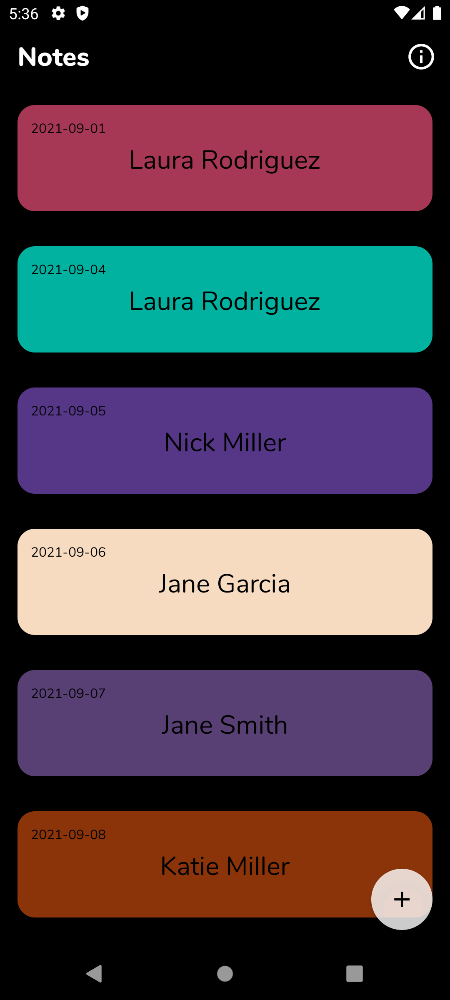

# **Technical documentation for project (Android)**

## **Overview**
Simple Note App follow modular architecture, clean architecture, and MVVM architecture. The project is written in `Kotlin` language and uses `Dagger 2` for dependency injection.
## **Architecture**
The project will make use of Clean Architecture to fully support S.O.L.I.D principles.
Clean architecture stands for a group of practices that produce systems that are:

* Independent of Frameworks.
* Testable.
* Independent of UI.
* Independent of Database.
* Independent of any external agency.

The purpose is the separation of concerns by keeping the business rules not knowing anything at all about the outside world, thus, they can can be tested without any dependency to any external element.

To achieve this, breaking up the project into 3 different layers, in which each one has its own purpose and works separately from the others. It is worth mentioning that each layer uses its own data model so this independence can be reached.

#### **Architecture Considerations** (If needed)
The application is written in  `Kotlin` language and will be using `MVVM` in the App layer

#### **Architecture Design** (If needed)

## **API Considerations**

## **Dependency Management**
For Dependency Management we are using `Dagger 2` along with `Android's` native `Binding Library`

## **References**
> Clean Architecture
* [ProAndroidDev Blog](https://proandroiddev.com/a-guided-tour-inside-a-clean-architecture-code-base-48bb5cc9fc97)
* [Five.Agency](http://five.agency/android-architecture-part-1-every-new-beginning-is-hard/)
* [Fernando Cejas Blog](https://fernandocejas.com/2014/09/03/architecting-android-the-clean-way/)

> Dagger2
* [Ray Wenderlich](https://www.raywenderlich.com/171327/dependency-injection-android-dagger-2)

## **Licensing**
#### **Simple Note Application**
## **Version**
JDK: 17
#### **Author**
Steve Nguyen Khac Phuc

## **Screen Cap**

